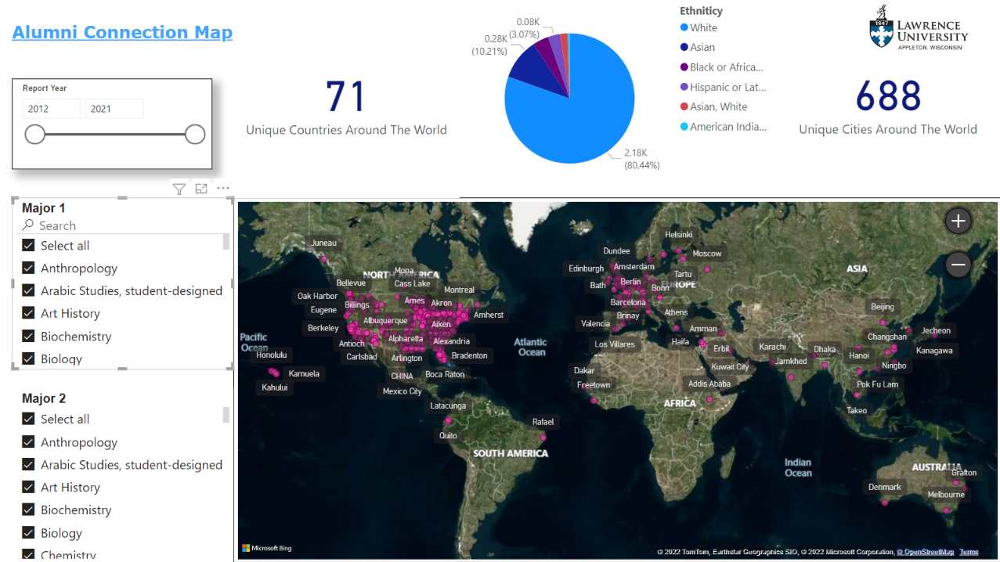

Below are the projects that I have worked on. Projects are labeled **Level 1 (Basic)**, **Level 2 (Intermediate)**, and **Level 3 (Advanced)** based on the amount and difficulty of programming skills used. The levels are assigned according to my programming abilities and knowledge. 

# [Project 1: Bookdown - R, SQL, Web Scraping](https://econ380w21.github.io/bpRaRw1Ky1RyM8Y1h/) (Level 2)

A book that I assembled upon completion of DataCamp Courses with notes and examples on the basics of R, SQL and Web Scraping.

- Introduction and Intermediate **R**  
- Introduction to the **Tidyverse**, Data Visualization with **ggplot2** 
- Categorical & Quantitative Data
- Cleaning, Joining and Data Manipulation(Basic Feature Engieering)
- Introduction to **SQL**
- Joining Data in **SQL**
- Web Scraping in **R**
- Simpe Linear Regression , Multiple Linear Regression
- Dummy Variable, Fixed Effects, Difference-in-Differences

# [Project 2: Power BI Dashboard : Alumni Location](https://github.com/raianrith/PowerBI-Alumni-Dashboard) (Level 2)

- Extensive use of R and Power BI Query for data wrangling and feature engineering
- An interactive dashboard that lets end user observe where Lawrence University Alumnis are located post graduation. 
- It let's users filter by preferred major, alumni graduation date, and ethnicity. 

# [Project 3: Machine Learning Project : Spam Classifier](https://github.com/raianrith/ML_SpamEmail) (Level 3)

- Project aims to figure out the best Spam Email Classifying algorithm within the algorithms used based on misclassification rates and true negatives.
- Data set collected at Hewlett-Packard Labs, classifies 4601 e-mails as spam or non-spam. 
- Optimal Choice : Bagging and Support Vectom Machine with linear Kernel - misclassification error rate of 12% (lowest among all models and approaches) and only 2 (lowest among all models and approaches) non spam emails being classified as spam emails. 

**Classifiers Used:**

- **Logistic Regression**
- **Linear Discriminant Analysis**
- **K Nearest Neighbour**
- **Decision Trees : Pruned Class Tree, Bagging, Random Forest**
- **Support Vector Machines: Linear, Polynomial, and Radial Kernels**

# [Project 4: Econometrics - Panel-Data Project](https://econ380w21.github.io/CP-GuiHungParkerRaian-w6Eg4UfA6P0q/) (Level 3)

 Panel-data project (PP) exploring exploring 2020 US Presidential Election results at the county level, together with county-level demographic data

- data obtained from the 2019 ACS 5-Year via the **tidycensus package**.
- **Big Data** cleaning, tidying, joining, manipulating, and feature engineering
- Creating Interactive U.S Maps
- Simpe Linear Regression , Multiple Linear Regression

# [Project 5: The iPhone Overview](https://github.com/raianrith/iPhone_RShiny) (Level 2)

- An **R Shiny App**  which helps users visualize the Sales, Battery Life, and Launch Price for each type of model of iPhones since the iPhone 3gs.
- Data gathered through **Web Scraping** using **Selector Gadget**
- Project includes **Data Taming**, **Data Tidying**, **Data Transformation**, **Data Manipulation**, and **Joining Data**
- Project includes advanced **ggplot** graphs
- User gets to switch between 2 Types of graphs (**Scatterplots** connected by **segments** and a user initiated **correlation**)
- Type 1 graph helps users visualize the Sales, Battery Life, and Launch Price for each type of model of iPhones since iPhone 3g
- Type 2 graph shows the correlations between any two among the 4 variables which the user chooses through the **Shiny App**
- Project strictly for implementation of **R-Shiny**, **Web Scraping**, **Data Manupulation**, and **GGplot** abilities. **Plot conclusions may/may not be accurate** due to insufficient data.

**Type 1 Graph**

**Type 2 Graph**

# [Project 6: Amazon Books Best Sellers](https://github.com/raianrith/Amazon_BestSeller) (Level 1)

- Short Blog on Yearly Best Selling Books by Amazon from years (2009 - 2019)
- Data Collected from **Kaggle**
- Basic **data cleaning**, **data manipulation**, **feature engineering**, **data visualization**
- Used **ggplot** and **ggplotly** to create **Interactive Plot**
- Project strictly for implementation of **ggplot** and **ggplotly** abilities. **Blog and plot conclusions may/may not be accurate** due to insufficient data.

